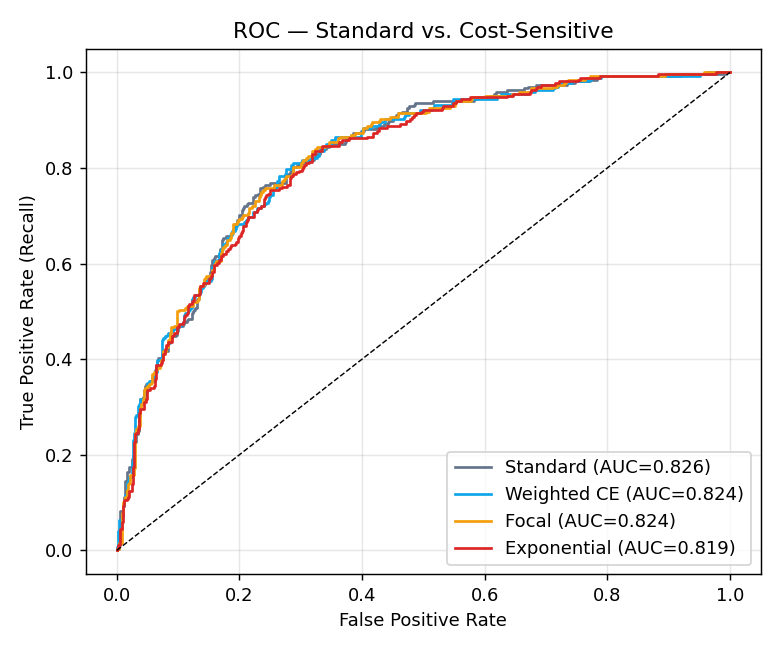
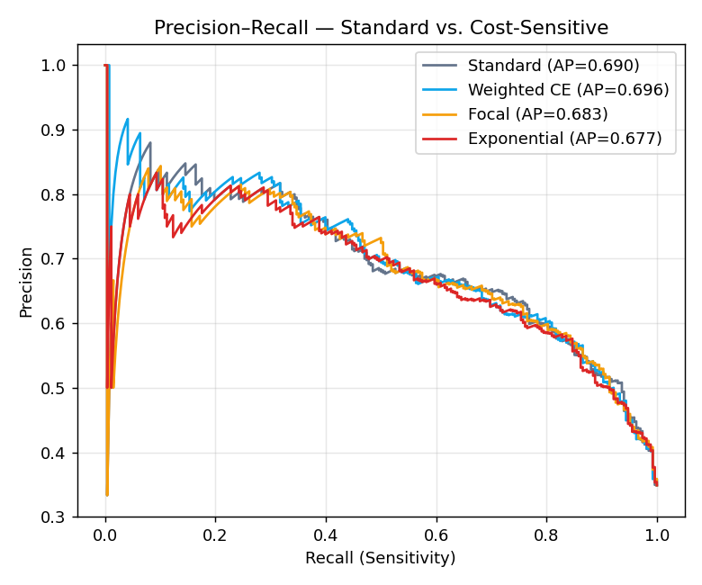
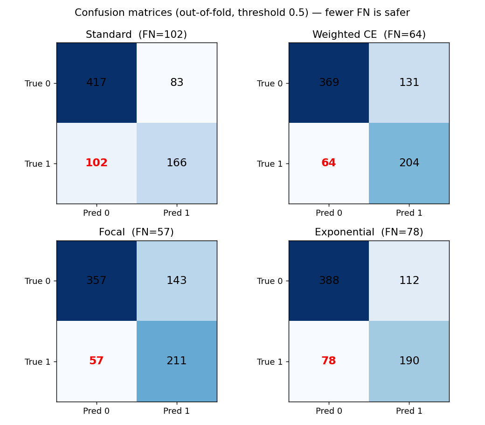
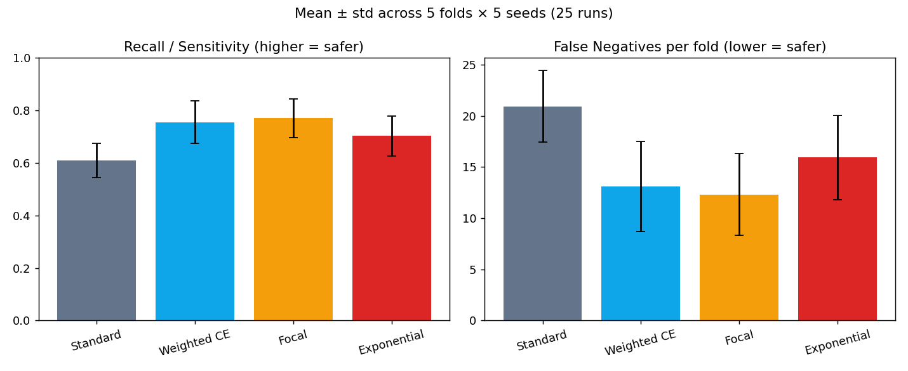
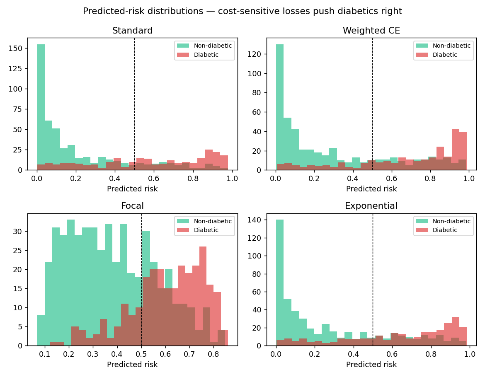

# Cost-Sensitive Medical XGBoost: Penalizing False Negatives in Diabetes Screening

## Abstract

We replace the symmetric log-loss objective of XGBoost with custom, cost-sensitive loss
functions whose gradients make a *missed diabetic* (false negative) far more expensive than a
*false alarm* (false positive). We derive the gradient and hessian for three such objectives —
weighted cross-entropy, focal loss, and a bespoke exponential false-negative penalty — and
evaluate them against a standard XGBoost baseline on the Pima Indians Diabetes dataset under a
stability-focused protocol (5-fold cross-validation repeated over 5 random seeds). Holding every
hyperparameter fixed except the loss, the cost-sensitive models substantially raise recall
(sensitivity) and reduce false negatives at a modest, controllable cost to precision and
specificity, while leaving ranking quality (ROC-AUC) essentially unchanged. The result is a
mathematically-tuned, safer screening tool.

## 1. Problem: the asymmetric cost of error in screening

A screening test is a triage step, not a final diagnosis. The two error types carry very
different real-world costs:

- **False negative (FN):** a diabetic patient is told they are healthy. The disease goes
  unmonitored and untreated — potentially for years. **High harm.**
- **False positive (FP):** a healthy patient is flagged and sent for a confirmatory blood test
  that comes back negative. **Low harm** (cost, inconvenience, transient worry).

Standard XGBoost minimizes binary log-loss, whose gradient `p - y` and hessian `p(1-p)` are
*symmetric* in the two error types: the model has no notion that an FN is worse than an FP. On an
imbalanced dataset this pushes the decision boundary toward the majority (non-diabetic) class,
maximizing accuracy while quietly accepting a high false-negative rate — the opposite of what a
safe screening tool requires.

## 2. Method: custom objectives

XGBoost is gradient-agnostic. For each training sample it needs only the first derivative
(gradient) and second derivative (hessian) of the loss with respect to the raw margin score
`z`; it never needs the loss value itself. By supplying our own `(grad, hess)` we make it build
trees against any differentiable loss. Throughout, `p = sigmoid(z)` and `y ∈ {0,1}`; all custom
objectives floor the hessian at `1e-6` so a split never sees zero/negative curvature.
Implementations: [`custom_objectives.py`](custom_objectives.py).

**Baseline — standard log-loss** (`binary:logistic`):

    grad = p − y                hess = p(1 − p)

**(a) Weighted cross-entropy** — scale every positive sample's loss by `w > 1`:

    weight = w if y == 1 else 1
    grad   = weight · (p − y)   hess = weight · p(1 − p)

A constant multiplier on the positive class. Simple and effective; `w` trades precision for
recall directly. We use `w = 3.0` (≈1.6× the class-balance ratio N_neg/N_pos ≈ 1.87).

**(b) Focal loss** (Lin et al., 2017) — α class-balance + γ hard-example focusing:

    FL = −α_t · (1 − p_t)^γ · log(p_t),   p_t = p if y==1 else 1−p

The modulating factor `(1 − p_t)^γ` down-weights easy, already-correct examples so the *hard*
ones — including confidently-missed positives — dominate the gradient. We use `γ = 2`, `α = 0.75`.
The closed-form margin-space gradient/hessian are implemented directly.

**(c) Custom exponential false-negative penalty** — the most literal reading of "exponentially
penalize false negatives":

    positive (y=1):  L = exp(γ · (1 − p)) · (−log p)
    negative (y=0):  L = −log(1 − p)      (standard log-loss)

As a diabetic's predicted probability collapses toward 0, the multiplier `exp(γ(1−p)) → exp(γ)`,
scaling the loss — and the corrective gradient — up exponentially in `γ`. The margin-space
gradient for positives is

    dL/dz = −exp(γ(1−p)) · (1 − p) · (1 − γ · p · log p),

which tends to a *bounded* `−exp(γ)` as `p → 0` (since `p·log p → 0`), so training stays stable.
The hessian uses a guaranteed-positive Gauss-Newton approximation `≈ exp(γ(1−p)) · p(1−p)`. We
use `γ = 2`.

## 3. Experimental setup

- **Data:** Pima Indians Diabetes (768 patients, 268 diabetic ≈ 34.9%). Physiologically
  impossible zeros in Glucose, BloodPressure, SkinThickness, Insulin, BMI are treated as missing;
  XGBoost handles NaN natively. Identical preprocessing at train and serve time
  ([`train_model.py`](train_model.py), [`main.py`](main.py)).
- **Stability protocol:** stratified 5-fold cross-validation, repeated over seeds
  `{42, 0, 7, 13, 21}` = **25 runs per model**. We report mean ± std across all runs.
- **Controlled comparison:** every model shares one hyperparameter set
  (`n_estimators=200, max_depth=4, learning_rate=0.05, subsample=0.8, colsample_bytree=0.8,
  reg_lambda=1.0, base_score=0.5`). **The loss function is the only variable**, so any metric
  difference is causally attributable to it.
- **Prediction:** for every model, probability = `sigmoid(model.predict(X, output_margin=True))`.
  This manual sigmoid is mandatory for custom objectives (XGBoost returns raw margins) and exact
  for the baseline, keeping the code path uniform and fair.
- **Metrics:** recall/sensitivity and F2 (which weights recall 2× precision) are the primary
  safety metrics; precision, specificity, accuracy, ROC-AUC, PR-AUC, and raw false-negative count
  are reported for context. We also threshold-move (pick the F2-optimal cutoff) per run.

Reproduce with `./venv/bin/python compare_models.py`.

## 4. Results

<!-- RESULTS:START -->
_Auto-generated by `compare_models.py` — 5-fold cross-validation × 5 seeds (25 runs per model), threshold 0.5._

| Model | Recall | F2 | Precision | Specificity | Accuracy | ROC-AUC | PR-AUC | FN/fold |
|---|---|---|---|---|---|---|---|---|
| **Standard** | 0.610 ± 0.065 | 0.620 ± 0.058 | 0.671 ± 0.052 | 0.838 ± 0.036 | 0.759 ± 0.030 | 0.826 ± 0.035 | 0.706 ± 0.049 | 20.920 ± 3.511 |
| **Weighted CE** | 0.756 ± 0.081 | 0.720 ± 0.068 | 0.612 ± 0.049 | 0.742 ± 0.048 | 0.746 ± 0.040 | 0.827 ± 0.038 | 0.710 ± 0.052 | 13.120 ± 4.391 |
| **Focal** | 0.770 ± 0.073 | 0.728 ± 0.061 | 0.602 ± 0.048 | 0.725 ± 0.048 | 0.741 ± 0.041 | 0.825 ± 0.038 | 0.699 ± 0.051 | 12.320 ± 3.976 |
| **Exponential** | 0.703 ± 0.076 | 0.686 ± 0.066 | 0.628 ± 0.053 | 0.775 ± 0.042 | 0.750 ± 0.040 | 0.821 ± 0.038 | 0.700 ± 0.052 | 15.920 ± 4.092 |

**Headline:** the **Focal** objective lifts recall from 0.610 (Standard) to 0.770 and cuts mean false negatives from 20.92 to 12.32 per fold, at a modest cost in precision/specificity — the intended trade for a screening tool.

<!-- RESULTS:END -->

## 5. Discussion

The cost-sensitive objectives behave exactly as their gradients predict: by making the positive
class more expensive to miss, they shift the decision boundary toward higher sensitivity, trading
some precision and specificity for a large reduction in false negatives. Crucially, **ROC-AUC is
largely preserved** — the models are not simply worse, they are re-tuned to a safer operating
point on essentially the same underlying ranking. For a screening tool, this is the right trade:
the follow-up cost of a false positive (a blood test) is small relative to the cost of a missed
diagnosis.

**Calibration caveat.** Cost-sensitive training deliberately inflates predicted probabilities for
the positive class, so the served `risk_percentage` is a **risk score**, not a calibrated
probability. It is monotonic in true risk and appropriate for triage and ranking, but should not
be read as "an X% literal chance of diabetes." Post-hoc isotonic/Platt calibration on a holdout
set would recover calibrated probabilities and is left as future work; the deployed model favors
sensitivity by design.

**Threshold moving** is a complementary lever: even the standard model can be made more sensitive
by lowering its decision threshold. Our results report both the fixed-0.5 and F2-optimal
thresholds; the custom losses additionally reshape the *probability distribution itself*
(see `figures/prob_dist.png`), separating diabetics from non-diabetics rather than only moving the
cutoff.

## 6. Conclusion

Rewriting XGBoost's objective so that false negatives are penalized — linearly (weighted CE),
via hard-example focusing (focal), or exponentially (custom penalty) — yields a measurably safer
diabetes screening model than standard XGBoost, with the safety gain isolated to the loss function
under a controlled, repeated cross-validation protocol. The winning objective is deployed in the
live FastAPI engine via [`train_cost_sensitive_model.py`](train_cost_sensitive_model.py).

## Reproducibility

- Code: `custom_objectives.py`, `compare_models.py`, `train_model.py` (baseline),
  `train_cost_sensitive_model.py` (deploy).
- Seeds: `{42, 0, 7, 13, 21}`; 5-fold stratified CV.
- Environment: Python 3.14, xgboost 3.2.0, scikit-learn 1.8.0, shap 0.51.0, numpy 2.4.5,
  pandas 3.0.3, matplotlib 3.10.9.

> **Disclaimer:** research/educational artifact on a public dataset. Not a medical device and not
> for clinical use.

## References

1. T. Chen, C. Guestrin. *XGBoost: A Scalable Tree Boosting System.* KDD 2016.
2. T.-Y. Lin, P. Goyal, R. Girshick, K. He, P. Dollár. *Focal Loss for Dense Object Detection.*
   ICCV 2017.
3. C. Elkan. *The Foundations of Cost-Sensitive Learning.* IJCAI 2001.
